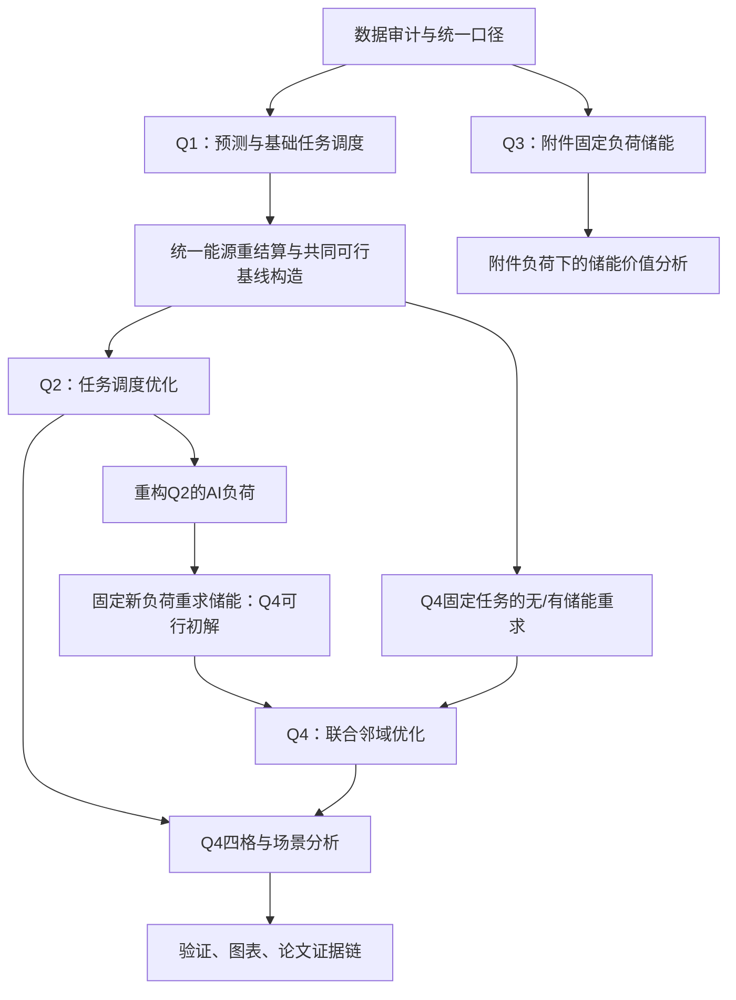

# 华数杯 C 题整体建模流程思路

## 1. 研究主线

本题的核心不是把四问各自做成互不相干的算法题，而是回答一个共同问题：当数据中心同时拥有**任务的时空弹性**和**物理储能**时，如何在服务约束下利用新能源、降低购电成本与碳排，并判断两种灵活性究竟是互补还是替代。

全文以同一条能量核算链连接四问：

```text
任务到达与服务约束
        ↓
不可抢占的区域—开工时刻调度
        ↓
逐时 AI IT 负荷 → 设施负荷
        ↓
新能源直供 / 充电 / 外送 / 弃电 / 电网购电
        ↓
储能状态与购电成本、碳排、峰值、波动
```

第一问建立数据理解、预测和基础可行调度；第二问只开放任务调度弹性；第三问固定附件负荷，只开放储能；第四问在同一任务集、同一服务约束和同一能源边界下让两种灵活性联合决策。这样得到的四格比较才有机制解释力。

本文档是模型与实施总纲。符号、单位和硬约束以 [术语表格.md](/Users/silver/math-26华数C/术语表格.md) 为准；精确公式、数据事实和边界以 [题目分析报告.md](/Users/silver/math-26华数C/题目分析报告.md) 为准；文件、命令、检查项和执行顺序以 [任务执行指南.md](/Users/silver/math-26华数C/任务执行指南.md) 为准。

## 2. 先建立统一的数据与评价口径

### 2.1 输入数据的角色

| 数据 | 在模型中的作用 |
|---|---|
| `workload_trace.xlsx` | 任务到达、类型、GPU需求、持续时间、截止与时延限制 |
| `GPU_information.xlsx` | 各区域GPU、IT与设施容量、PUE |
| `network_latency.xlsx` | 来源区域到执行区域的可达性约束 |
| `power_mapping.xlsx` | 三类任务的单位GPU IT功率 |
| `region_time_data.xlsx` | 逐时新能源、电价、售电价、碳强度、非AI负荷及附件基准结果 |
| `storage_information.xlsx` | 储能容量、初态、效率、充放电功率、购售电边界 |

原始附件是只读输入。附件中已有的购电、新能源利用和SOC是原始运行结果，不是优化模型必须复制的决策。尤其不能将附件中的 `UsedRenewable` 当作新能源直用上限。

### 2.2 时间、任务与功率口径

任务在小时区间内按真实持续时间计算占用，不能将分钟时长整体向上取整。令任务 (i) 在时刻 (s) 开工、持续 (d_i) 小时，则它在小时 (t) 的重叠时长为

\[
\alpha_{ist}=\max\{0,\min(t+1,s+d_i)-\max(t,s)\}.
\]

若任务被分配到区域 (r)，其逐时GPU平均占用和AI IT功率分别由 (g_i\alpha_{ist}) 与 (p_{k_i}g_i\alpha_{ist}) 累加得到。总IT功率为非AI固定负荷加AI IT功率，设施负荷为总IT功率乘该区PUE。

任务必须完整、连续地在同一区域执行；不拆分、不抢占、不在运行中迁移。实时任务到达即开工，但其执行区域仍可在时延可达区域中选择。所有任务须在2406前完成；第2406小时没有AI任务占用，但非AI负荷、储能和电力结算仍存在。

### 2.3 统一能源结算

每个区域—小时拆分新能源为：直供负荷 (R^{load})、新能源充电 (R^{ch})、新能源外送 (R^{sell})、弃电 (R^{curt})；电网拆为供负荷 (G^{load}) 和电网充电 (G^{ch})。储能放电 (D) 只供本地负荷。

\[
R^{load}+R^{ch}+R^{sell}+R^{curt}=R,
\]
\[
R^{load}+G^{load}+D=L,\qquad C=R^{ch}+G^{ch},
\]
\[
B=G^{load}+G^{ch},\qquad P^{sell}=R^{sell}.
\]

于是电费、碳排和新能源利用率为

\[
F=\sum_{r,t}(\pi_{rt}B_{rt}-\pi^{sell}_{rt}P^{sell}_{rt})\Delta t,
\]
\[
E=\sum_{r,t}c_{rt}B_{rt}\Delta t,\qquad
\eta_R=\frac{\sum(R^{load}+R^{ch}+R^{sell})\Delta t}{\sum R\Delta t}.
\]

碳排只由购电计算；售电不抵消碳排。电网充电不算作新能源利用；电池放电也不能在新能源利用率中重复计量。

### 2.4 基线与收益的统一命名

| 标签 | 政策 |
|---|---|
| O | 附件原始运行结果 |
| N | 固定任务或固定负荷，统一能源重新结算，无储能 |
| S | 同一固定任务或固定负荷，优化储能 |
| T | 优化任务，无储能 |
| J | 任务与储能联合优化 |

为消除论文阅读中的歧义，Q3正文记作 \(N^A\)、\(S^A\)，其中A表示附件固定负荷；Q4正文只使用 \(F_{00},F_{10},F_{01},F_{11}\) 的四格记号。O/N/S/T/J保留为结果目录和RunID的机器可读标签。Q3的 N/S 属于 `Q3_attachment_load` 基线族；Q4的 N/S/T/J 属于 `Q4_feasible_tasks` 基线族，即使用同一份共同可行任务方案和同一任务集。两个基线族不可混用。

成本变化写为 (F(S)-F(N))、(F(T)-F(N))，正向节省写为 (F(N)-F(S))、(F(N)-F(T))。(F(O)-F(N)) 只能称作“附件原始运行结果与统一口径重新结算的差异”，因为它可能同时混入能源分配、终端SOC、任务负荷和附件策略差异，不能归因于一种机制。

## 3. 总体求解流程



实施顺序上，先构建唯一的数据读取、任务占用、负荷重构、能源结算和独立检查模块；每一问只调用这些公共模块，不在各题内重复写口径。所有方案导出任务级 `schedule.csv`、逐时 `hourly.csv`、指标、界和检查报告，论文数字只从通过检查的输出中读取。

## 4. Q1：需求预测与基础可行调度

### 4.1 Q1要回答什么

第一问同时回答两个不同问题：需求是否可预测，以及在实际到达任务下如何形成满足硬约束的基础调度。预测结果不替代后续优化中的真实任务输入；它用于资源预判和展示预测能力。

预测对象以“区域 × 任务类型 × 小时”的到达GPU需求为主，并同时给出到达GPU·小时、任务数和真实逐时占用，避免把四种量混淆。时间切分固定为：0—2351训练、2352—2375验证选模、0—2375重训、2376—2399最终测试。最终测试不得泄漏测试期真实值。

### 4.2 预测模型

先构建简单基准（历史均值、最近窗口均值或季节性朴素法），再从统一特征回归中选择一个经验证更好的模型。特征可包括区域、类型、小时、历史滞后和滚动统计。评价采用MAE、RMSE与WAPE；零分母时WAPE不定义，不用大量零值组的MAPE制造漂亮数字。

若复杂模型没有稳定优于基准，就保留简单模型，并将“短样本与高稀疏性限制预测增益”作为真实发现，而不是强行堆叠更多模型。

### 4.3 基础调度

以真实任务为输入，构建区域—开工时刻二元决策。实时任务固定到达时刻开工；训练和批量任务可在到达后、截止前选择开工时刻。候选区域由网络时延过滤。目标采用字典序：先最小总等待，再最小总网络时延，再改善峰值资源占用；服务硬约束不能用惩罚项软化。

最后24小时任务调度时必须保留前序任务的在运行占用与尚未开工积压，且将2400—2405的收尾包含进结果。Q1产出的是任务侧可行基础方案，它只是共同基线构造的候选输入，尚未自动成为Q2/Q4的能源可行基线。

共同可行基线的构造是：Q1基础方案 → 统一能源重结算 → 检查购电、外送、能量平衡及适用的储能边界。通过后才冻结为Q4的固定任务基线；不通过时仅允许做可追溯的最小任务调整或能源可行修复，并另存修复前后方案和违反位置，不能静默替换。

## 5. Q2：无储能条件下的碳感知任务调度

### 5.1 模型目标

Q2隔离任务时空调度的作用：储能关闭，任务可以在可达区域和允许时段重新指派。主目标为最小电费，碳排、平均网络时延和新能源利用率采用 ε-constraint 形式：

\[
\min F,\quad E\le\varepsilon_E,\quad H\le\varepsilon_H,\quad \eta_R\ge\varepsilon_R.
\]

先分别求可行的成本、碳、时延、利用率端点，再在真实可行区间内挑选少量预算点。若碳约束不活跃或最小碳为零，应报告退化，不人为制造Pareto曲线。

### 5.2 为什么不能直接全量MILP

5万任务、多个区域和大量可选起点会产生极大的二元变量规模。直接对全时域全候选精确MILP求全局最优，既不一定可行，也不应预先承诺。因此采用“松弛—恢复—重优化”的求解策略：用严格定义的连续松弛获得结构信息和有效下界，用完整任务方案恢复可行解，再用大邻域MILP持续改进。

### 5.3 三步算法

第一步是连续松弛。小实例中可直接放松完整任务候选变量；全量实例使用保留来源、类型、目的区域、小时和累计到达约束的聚合工作流松弛。松弛必须满足“每个原问题可行解都能映射到松弛可行域”的条件，才可作为下界。若删除等待等约束，必须在界证书中明确它是更弱的放松。

第二步是可行恢复。依据松弛给出的区域—时段水位、能源边际价格和资源余量筛选候选，再对完整TaskID进行不可抢占落位。恢复失败时扩大候选集、交换未开工任务或做局部MILP修复，绝不通过放宽GPU、IT、设施、时延、截止或SOC硬约束来“修复”。

第三步是大邻域重优化。每轮选择处在高边际成本时段、容量瓶颈时段或两类时段重叠处的任务；放开这些任务的区域与开工时刻，同时固定其余任务实际占用并重新求能源分配。只有全量约束检查和电费重算确认改善后才接受新方案。

候选筛选使用的边际价格只是一阶启发式。若 λ 已来自包含碳约束的连续模型，它已经反映碳约束，不能再叠加 μ×碳强度。MILP不直接解释全局对偶；碳的边际代价采用同一模型、相邻可行预算的有限差分。

无储能且购电上限不绑定、买价不低于卖价时，给定设施负荷L、可用新能源R和外送上限X，能源分流可解析为 \(B=(L-R)^+\)、\(P^{sell}=\min\{(R-L)^+,X\}\)。因此新增1MWh负荷的局部边际成本为：存在弃电（\(R-L>X\)）时为0；无弃电但仍有可外送新能源（\(0<R-L<X\)）时为 \(\pi^{sell}\)；新能源不足（\(L>R\)）时为 \(\pi^{buy}\)。前两段的边际碳排为0，第三段为碳强度c。

这给出“弃电—外送—购电”三段机制：吃掉弃电近似免费且零碳，占用外送绿电具有机会成本，新增购电才产生购电成本和碳排。分界点不可微，或购电/外送边界、服务约束绑定时，应回到完整分流模型；实际候选排序继续由松弛模型的 \(\lambda_{rt}\) 给出。实现可用已证明等价的分段成本函数缩小Q2求解模型，但公共检查器始终保留完整能源流并独立复算。

### 5.4 上下界与算法证据

完整可行方案成本给出 UB；包含原问题可行域的松弛最优值或有效对偶界给出 LB。主指标是

\[
\Delta=UB-LB.
\]

需要跨场景比较时使用固定的正成本尺度 (C_{ref})：

\[
\Delta_{norm}=\Delta/C_{ref}.
\]

每个界必须标注 `full_problem`、`restricted_candidate` 或 `conditional_subproblem`。只有完整问题的有效LB才能用来讨论全问题界差；候选集内界只能讨论候选集内结果。

若要将“价格+瓶颈引导”写作改进方法，必须做等预算消融：普通或随机候选、价格引导、瓶颈引导、联合引导采用相同墙钟预算、初解、候选数量、邻域大小、停止规则和配对种子。比较UB、同一有效LB下的Δ、可行率和耗时。若没有稳定优势，论文仅称其为核心求解策略。

## 6. Q3：固定附件负荷下的储能优化

### 6.1 目的与模型

Q3不是调度问题。设施负荷严格固定为附件基准AI IT负荷与非AI负荷之和乘PUE。决策是新能源分配、购售电、充放电与SOC，目标为成本最小，并可加入碳、区域净购电峰值和爬坡约束。

储能状态满足

\[
q_{rt}=q_{r,t-1}+\eta^c_r C_{rt}\Delta t-D_{rt}\Delta t/\eta^d_r,
\]

其中 (q_{r,-1}) 为初始SOC，所有时段满足容量界，且 (q_{r,2406}\ge q_{r,-1})。终端约束使储能不能靠消耗初始电量虚构节省。

### 6.2 LP-first / MILP-guaranteed

储能模式互斥可用二元变量表达：充电与放电在同一小时不能同时为正。求解顺序为：

```text
先解取消模式二元变量的 LP
          ↓
检查所有区域、所有小时是否互斥
          ├─ 全部互斥：LP解也是原MILP的最优解
          └─ 存在循环：在主成本最优面次级最小化总吞吐量
                              ↓
                         再次检查互斥
                              ├─ 通过：记录主目标容差内最优
                              └─ 不通过：加入模式二元变量，求MILP
```

次级优化必须保持主成本不超过LP最优值加公开容差。若LP未证最优、次级问题失败或仍有同时充放电，则必须回退MILP。这个流程逐个场景执行，不能因为一个场景LP有效就推广到所有场景。

### 6.3 Q3结果应如何解释

主对照是同一固定负荷下 N 与 S：(F(N)-F(S)) 是储能正向节省，(F(S)-F(N)) 是成本变化。另报告碳、净购电峰值、平均绝对爬坡、吞吐、损耗与终端SOC。若新能源足够充裕而储能减碳很小，应如实说明其边界条件。

储能的价值分为三类，不能混成一个“储能价值”：给定时点额外SOC的存量电量价值、扩大容量上限的容量价值、同时放宽外送边界的外送通道价值。每类扰动均固定其他边界、记录单位和求解不确定性。Q3的价值不能直接作为Q4联合模型中的固定价值函数。

## 7. Q4：任务与储能联合优化

### 7.1 联合模型的逻辑

Q4把Q2的任务决策与Q3的能源、储能决策合并，目标仍为成本最小，服务质量、碳、利用率、时延、区域峰值等通过ε约束或分层目标控制。这里的关键是：任务调度会改变逐时、逐区AI负荷；储能策略必须针对这个新负荷重新求解。

因此联合初解只能按如下顺序构造：

```text
Q2可行任务方案
  → 重构逐时逐区AI负荷
  → 固定该负荷重新优化储能
  → 全量检查
  → 联合大邻域优化
```

不能把Q3储能序列直接拼到Q2任务方案上，因为Q3的负荷来自附件，与Q2重新调度后的负荷不同。

### 7.2 联合大邻域重优化

以联合可行初解为起点，选择高价格、容量紧张或储能边界活跃时段周边的任务，放开其任务变量及受影响时段的能源/储能变量。未放开的任务仍以实际占用计入负荷；如果只优化局部时窗，必须固定窗首、窗尾SOC，确保局部方案可以拼回全时域。

每轮流程为“筛选邻域 → 联合MILP → 独立可行性检查 → 重算真实指标 → 仅接受实际改善”。保留最好可行解，记录候选范围、时间预算、有效界和停止原因。此方法可称“联合邻域求解策略”，只有消融实验给出稳定证据时才升级为算法创新。

### 7.3 四格交互：互补还是替代

在同一任务集、同一服务质量约束、同一能源边界、同一结算期和同一场景中重新求解：

\[
F_{00}=F(N),\quad F_{10}=F(T),\quad F_{01}=F(S),\quad F_{11}=F(J).
\]

联合收益和交互项为

\[
Benefit=F_{00}-F_{11},
\]
\[
I=F_{10}+F_{01}-F_{11}-F_{00}.
\]

若四项都有有效最优界 (L_{ab}\le F^*_{ab}\le U_{ab})，则进一步构造

\[
I_{low}=L_{10}+L_{01}-U_{11}-U_{00},
\]
\[
I_{high}=U_{10}+U_{01}-L_{11}-L_{00}.
\]

仅当 \(I_{low}>\tau_I\) 时才称互补；仅当 \(I_{high}<-\tau_I\) 时才称替代；否则结论是“当前求解精度不足以判定交互符号”。\(\tau_I\) 仅由求解器绝对目标容差、独立重算误差和能量残差对应的最大成本误差构成，不是人为经济显著性阈值。若缺少有效界，只可报告已实现方案的交互量，不能把其正负解释为最优政策的机制结论。

## 8. 场景分析：寻找转折区间，而非虚构临界点

场景用于测试模型的适用边界，不是将人为设定的输入误写成现实预测。优先单因素改变：碳预算、电价峰谷差、新能源规模，再选择少量组合压力场景。

新能源规模 ρ 先按 (1.0,0.9,\ldots,0.4) 粗扫。若相邻点在任务迁移比例、储能绝对节省或交互量上出现大于求解误差的结构变化，再在该区间按0.02细扫。最终报告“策略转折主要发生在 [ρ_low,ρ_high] 区间”，连同网格分辨率和求解不确定性；不将离散扫描结果包装为精确理论临界点。

主分析中，每个核心场景均使用同一共同可行任务基线来比较四格方案。若新增场景令共同基线不可行，“共同基线失效区间”本身就是结果，应报告首个失效场景、违反的约束和位置；不得悄悄改变其任务排布后仍称为同一基线。若还要研究更低新能源区间，可单独构造“场景特定共同可行基线”，作为扩展分析单列结果，不与主分析的交互曲线连接或混算。

## 9. 验证链：先证明可信，再写结果

验证分为四层。

第一层是数据审计：检查任务唯一性、时间和区域键完整性、单位、表间重构残差、输入哈希及原始基准SOC终端情况。

第二层是手算与小实例：验证重叠占用、任务功率、SOC递推、能源守恒、碳和电费；在小实例枚举任务分配并与完整MILP比较；验证原可行方案可映射至松弛问题。

第三层是每个正式方案的独立检查：从导出的任务和逐时结果重算GPU、IT、设施容量、时延、任务完成、能源守恒、购售电、SOC、碳、成本和指标。检查器不得只读取优化器内部变量。

第四层是稳健性证据：候选集扩大、时间网格细化、代表时窗精确比较、不同随机种子、场景扫描及算法消融。其作用是界定近似算法的可信范围，不是为了强行得到更好数字。

所有结果必须同时记录求解状态、时间、UB、LB、界的适用范围和最大约束残差。没有有效LB时，明确写“全问题最优性差距不适用”；没有通过独立检查时，不能进入图表或论文。

## 10. 图表与论文的证据组织

论文围绕“结构—决策—收益—边界”展开，而不是按算法名字堆砌章节。

| 论文部分 | 回答的问题 | 证据来源 |
|---|---|---|
| 问题分析与数据审计 | 任务结构、新能源与容量瓶颈是什么 | 原始数据统计、重构检查 |
| Q1 | 需求是否可预测、基础调度是否可行 | 时间切分、预测误差、甘特图、利用率 |
| Q2 | 任务迁移何时降低成本或碳 | ε权衡、迁移矩阵、边际价格和瓶颈表 |
| Q3 | 固定负荷下储能如何工作、价值来自哪里 | N/S对照、SOC/功率、峰值与三类边际价值 |
| Q4 | 联合优化是否带来额外价值 | N/T/S/J四格、服务质量、交互界区间 |
| 验证与场景 | 结论在哪些条件下成立 | 上下界、小实例、消融、转折区间 |

图表至少覆盖三类内容：原始数据图（需求和能源结构）、求解过程图（界差、迭代、SOC和积压）、最终结果图（策略对比、Pareto、场景变化）。每张图必须能追溯到RunID和结果表。摘要最后写，所有数字都来自已经冻结并通过检查的结果。

## 11. 实施顺序与交付清单

1. 数据审计并冻结输入哈希、公共配置与数值容差。
2. 写公共读取、占用、负荷重构、能源结算和独立检查模块；用手算与小实例测试。
3. 完成Q1预测与基础可行调度，保留最后24小时的前序占用。
4. 建立共同任务基线N，完成Q2任务调度T与松弛—恢复—重优化证据。
5. 以附件固定负荷完成Q3 N/S与LP-first/MILP流程。
6. 由Q2调度重构负荷并重求储能，获得Q4联合可行初解，再完成J。
7. 在Q4共同基线族完成四格对照、交互界区间与场景转折区间。
8. 完成图表、复现清单、主张—证据映射和论文草稿。

交付时应包含：可运行代码、锁定依赖和配置、Q1—Q4的任务与逐时结果、独立检查报告、界证书、场景与图表、复现清单及根据真实结果撰写的论文草稿。当前项目已经完成模型合同和M1审阅，但尚未产生Q1—Q4的真实求解结果；因此本文件中的所有“收益”“转折”和“互补/替代”均是待验证的研究问题，而不是预设结论。
